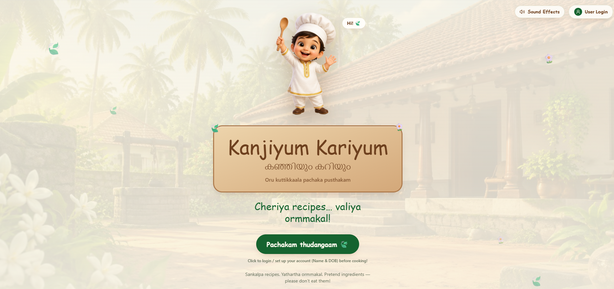
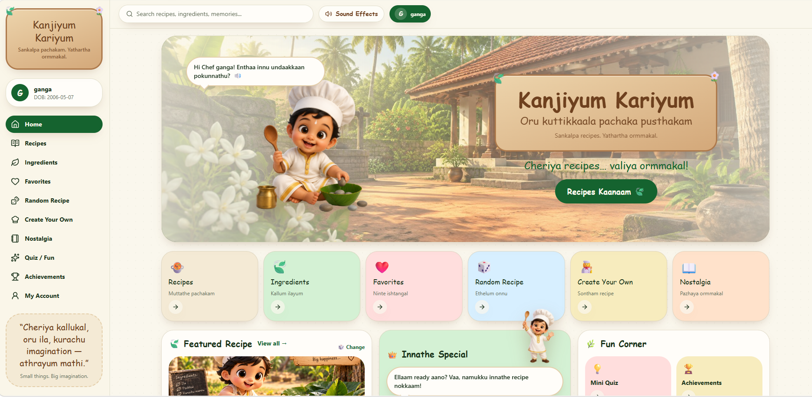
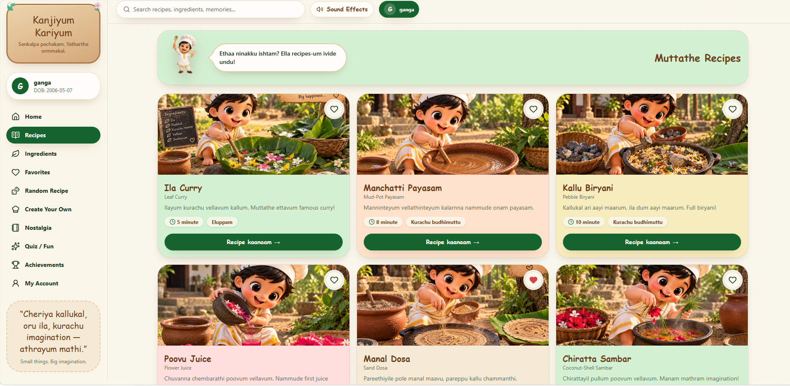

# Kanjiyum kariyum 🎯


## Basic Details
### Team Name: Tedhe medhe


### Team Members
- Team Lead: Ganga V-SJCET
- Member 2: Aishwarya Pramod Nair-SJCET

### Project Description
Kanjiyum Kariyum is a nostalgic digital recipe book inspired by the imaginary cooking games played by children in 90s Kerala. It transforms simple natural objects like stones, leaves, flowers, mud and grass into fun imaginary recipes.

### The Problem (that doesn't exist)
Children today are facing a serious problem — they don't know how to make biriyani using stones, curry using leaves, or payasam using mud. Our project solves this completely unnecessary problem by bringing back the forgotten art of childhood pretend cooking.

### The Solution (that nobody asked for)
We created a digital recipe book where users can explore hilarious imaginary recipes such as Kallu Chor, Kallu Biriyani, Manchatti Payasam, Manal Dosa, Chiratta Sambar and Mannappam. Users can browse recipes, explore pretend ingredients, create their own recipes, save favourites and enjoy a nostalgic childhood experience through the Baby Chef.
## Technical Details

### Technologies/Components Used

#### For Software:
- *Languages used*: TypeScript, JavaScript (ES2024), HTML5, CSS3
- *Frameworks used*: React 19, TanStack Start (SSR Framework), Vite 8
- *Libraries used*:
  - @tanstack/react-router (File-based Routing & State Management)
  - @tanstack/react-query (Data fetching & state caching)
  - @tailwindcss/vite & tailwindcss v4 (Utility-first styling & design system)
  - @radix-ui/* (Accessible UI primitives)
  - lucide-react (Vector icons)
  - Web Audio API (Procedural ambient sound synthesis)
  - zod, date-fns, clsx, tailwind-merge
- *Tools used*:
  - Node.js / Bun (Package Management & Runtime)
  - Vite (Dev Server & Build Tool)
  - ESLint, Prettier (Code Formatting & Quality)
  - Git & GitHub (Version Control)

#### For Hardware:
- *Main components: N/A *(Pure Software Web Application)
- *Specifications*: Any desktop computer, laptop, tablet, or smartphone capable of running a modern HTML5 web browser (Chrome, Firefox, Safari, Edge)
- *Tools required*: Keyboard/Mouse or Touchscreen, Audio Output (Speakers or Headphones for the ambient Adukkala Soundboard experience)

---

### Implementation

#### For Software:

# Installation
```bash
# 1. Clone the repository
git clone https://github.com/ganga8089/useless_project_temp.git

# 2. Navigate to project directory
cd useless_project_temp

# 3. Install project dependencies
npm install

### Project Documentation
For Software:

# Screenshots 

Landing page introducing Kanjiyum Kariyum with the Baby Chef, nostalgic Kerala background and project theme.


Home page showing the main navigation, search bar, Baby Chef, featured recipe and quick-access sections.


Recipes page displaying the collection of imaginary childhood recipes with recipe cards, cooking time and difficulty.

# Diagrams

*Add caption explaining your workflow*

For Hardware:

# Schematic & Circuit

*Add caption explaining connections*


*Add caption explaining the schematic*

# Build Photos

*List out all components shown*


*Explain the build steps*


*Explain the final build*

### Project Demo
# Video
[Add your demo video link here]
*Explain what the video demonstrates*

# Additional Demos
[Add any extra demo materials/links]

## Team Contributions
- [Name 1]: [Specific contributions]
- [Name 2]: [Specific contributions]
- [Name 3]: [Specific contributions]

---
Made with ❤️ at TinkerHub Useless Projects 


